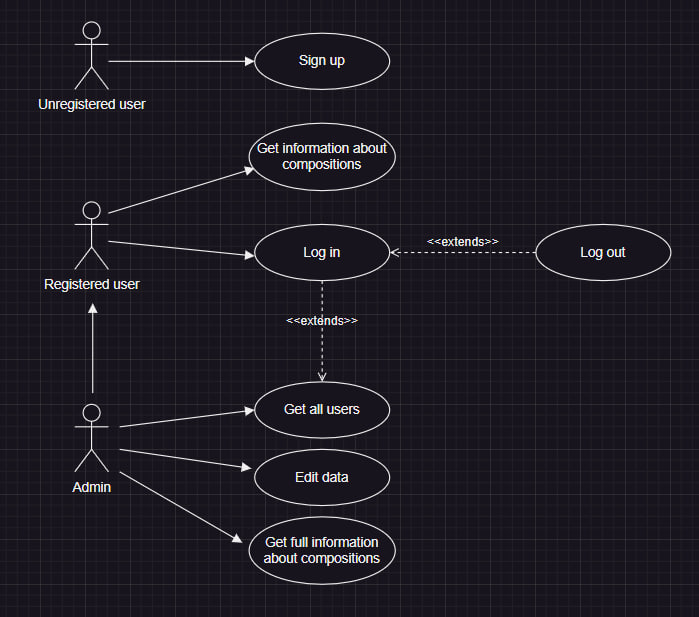

# Функциональные требования
## Описания функциональных требований

| Функция | Описание |
| --- | --- |
| Авторизация | Позволяет войти или же выйти из систему, используя логин и пароль |
| По всем заказам | Позволяет администратору узнать кол-во всех поступивших заказов |
| Самый популярная композиция | Позволяет администратору узнать информацию о самой популярной композиции цветов |
| Срочные заказы | Позволяет администратору узнать информацию о срочных заказах |
| Использованные цветы | Позволяет администратору узнать информацию о цветах, которые уже были задействованы |
| Проданные композиции | Позволяет администратору узнать информацию о проданных композиции цветов |
| Добавить информацию | Позволяет администратору добавить информацию о цветах/композиции |
| Изменить столбы | Позволяет администратору изменить содержание/количество столбцов в системе |
| Изменить цену | Позволяет администратору изменить цену цветов/композиции |
| Информация о всех заказах за день | Позволяет администратору узнать информацию о всех заказах поступивших за день |

## Текстовые сценарии

| Ситуация | Сценарий |
| --- | --- |
| Первый вход в систему | Пользователь видит перед собой строку регистрации в системе, ему предлагается придумать логин и пароль, пользователь сохраняется в базе данных |
| Вход в систему | Вход осуществляется по логину и паролю |
| Вход от имени пользователя | Доступ к ограниченному набору функций |
| Вход от имени администратора | Доступ к полному набору функций |
| Использование доступных функций | В соответствии с выбранной функцией происходит запрос к базе данных и вывод информации |
| Выход из учетной записи | Возможность вернуться к авторизации и зайти под именем другого пользователя |
| Выход из системы | Программа прекращается |

## Диаграмма использования

